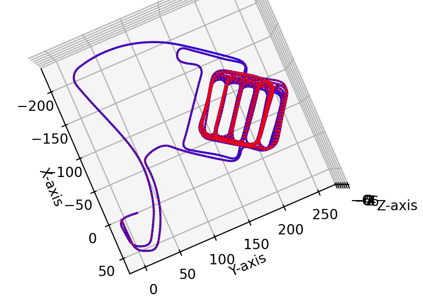
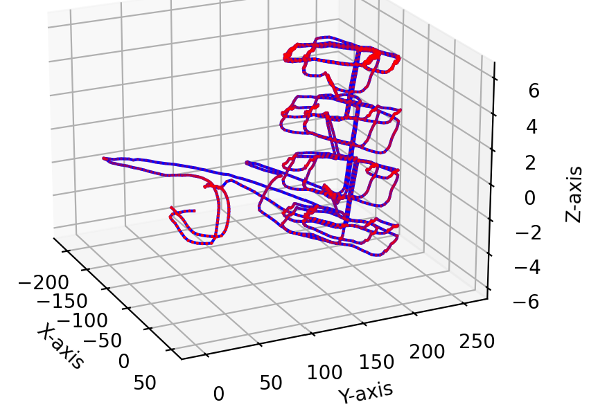

# Graph-Slam-Implementation
## 2D GraphSLAM Simulation

This repository contains a Python script (`main.py`) for simulating 2D GraphSLAM using a grid world environment and a mobile robot. Below are the instructions on how to run the simulation.

### Prerequisites

Before running the simulation, ensure that you have the required Python libraries installed. You can do this by navigating to the project folder (`2D_GraphSLAM`) and running the following command:

```
pip install -r requirements.txt
```

### Running the Simulation

Once you have installed the required libraries, you can run the 2D GraphSLAM simulation by following these steps:

1. Open a terminal or command prompt.

2. Navigate to the project folder (`2D_GraphSLAM`) using the `cd` command:

```
cd path/to/2D_GraphSLAM
```

3. Run the `main.py` script:

```
python main.py
```

4. The simulation will run, and you will see a visualization of the robot's trajectory and landmark observations. The visualization includes the robot's estimated pose (blue dots), the true pose (green dots), landmark positions (yellow stars), and sensor measurements (red lines).

5. After the simulation completes, you will also see the final state of the GraphSLAM optimization, including the refined pose estimates.

### Simulation Configuration

You can customize the simulation by modifying the parameters in the `main.py` script. These parameters include the world size, the number of landmarks, sensor range, time step, and control inputs. Feel free to experiment with different settings to observe how GraphSLAM performs under various conditions.

### Results

Here are some results and visualizations from the simulation:

#### GraphSLAM Optimization - Robot Trajectory and Few Landmarks


In this plot, you can see the robot's trajectory (blue dots) and the true pose (green dots). Landmark positions are represented by yellow stars, and sensor measurements are shown as red lines.

#### GraphSLAM Optimization - Robot Trajectory and More Landmarks


After running the GraphSLAM algorithm, you can visualize the optimized robot pose estimates.

### Conclusion

The experiments conducted revealed that the least-squares optimization method employed in the GraphSLAM algorithm was sensitive to initialization. Noisy initial pose estimates led to significant localization errors. Furthermore, it was observed that as the number of landmarks increased, the performance of the GraphSLAM algorithm, as measured by localization error, deteriorated. More favorable results were achieved with fewer landmarks, suggesting that a higher number of landmarks introduced additional noise into the system that the algorithm struggled to account for. Increasing the number of iterations did not mitigate the adverse effects of having more landmarks on the algorithm’s performance.

If you have any questions or encounter any issues, please don't hesitate to reach out for assistance. Enjoy experimenting with GraphSLAM!

### References

[Python Robotics (Graph-Based SLAM by A. Sakai)](https://atsushisakai.github.io/PythonRobotics/modules/slam/graph_slam/graph_slam.html#graph-slam-for-a-real-world-se-2-dataset "Python Robotics (Graph-Based SLAM by A. Sakai)")
[Python Robotics (Graph-Based SLAM by A. Sakai)](http://www2.informatik.uni-freiburg.de/~stachnis/pdf/grisetti10titsmag.pdf "PA Tutorial on Graph-Based SLAM by G. Grisetti et'al")

## 3D GraphSLAM Simulation




## References

[Python Robotics (Graph-Based SLAM by A. Sakai)](https://atsushisakai.github.io/PythonRobotics/modules/slam/graph_slam/graph_slam.html#graph-slam-for-a-real-world-se-2-dataset "Python Robotics (Graph-Based SLAM by A. Sakai)")
[A Tutorial on Graph-Based SLAM by G. Grisetti et'al"](http://www2.informatik.uni-freiburg.de/~stachnis/pdf/grisetti10titsmag.pdf "A Tutorial on Graph-Based SLAM by G. Grisetti et'al")
[GraphSLAM Solver Toolbox](https://github.com/JeffLIrion/python-graphslam "GraphSLAM Solver Toolbox")