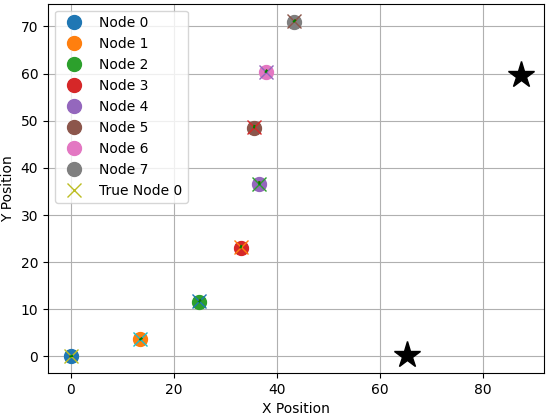
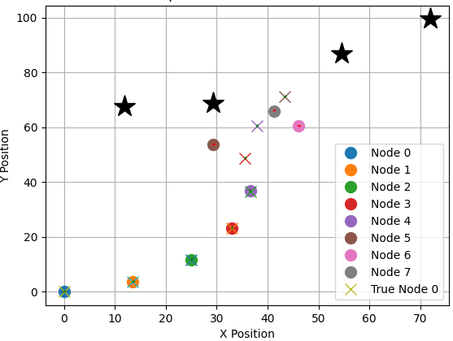

# Graph-Slam-Implementation
## 2D GraphSLAM Simulation

This repository contains a Python script (`main.py`) for simulating 2D GraphSLAM using a grid world environment and a mobile robot. Below are the instructions on how to run the simulation.

### Prerequisites

Before running the simulation, ensure that you have the required Python libraries installed. You can do this by navigating to the project folder (`2D_GraphSLAM`) and running the following command:

```
pip install -r requirements.txt
```

### Running the Simulation

Once you have installed the required libraries, you can run the 2D GraphSLAM simulation by following these steps:

1. Open a terminal or command prompt.

2. Navigate to the project folder (`2D_GraphSLAM`) using the `cd` command:

```
cd path/to/2D_GraphSLAM
```

3. Run the `main.py` script:

```
python main.py
```

4. The simulation will run, and you will see a visualization of the robot's trajectory and landmark observations. The visualization includes the robot's estimated pose (blue dots), the true pose (green dots), landmark positions (yellow stars), and sensor measurements (red lines).

5. After the simulation completes, you will also see the final state of the GraphSLAM optimization, including the refined pose estimates.

### Simulation Configuration

You can customize the simulation by modifying the parameters in the `main.py` script. These parameters include the world size, the number of landmarks, sensor range, time step, and control inputs. Feel free to experiment with different settings to observe how GraphSLAM performs under various conditions.

### Results

Here are some results and visualizations from the simulation:

#### GraphSLAM Optimization - Robot Trajectory and Few Landmarks



In this plot, you can see the robot's trajectory (blue dots) and the true pose (green dots). Landmark positions are represented by yellow stars, and sensor measurements are shown as red lines.

#### GraphSLAM Optimization - Robot Trajectory and More Landmarks



After running the GraphSLAM algorithm, you can visualize the optimized robot pose estimates.

### Conclusion

This simulation is designed for educational purposes and may not reflect real-world scenarios accurately. It provides a simplified environment for understanding the basic principles of 2D GraphSLAM.

If you have any questions or encounter any issues, please don't hesitate to reach out for assistance. Enjoy experimenting with GraphSLAM!

### References


